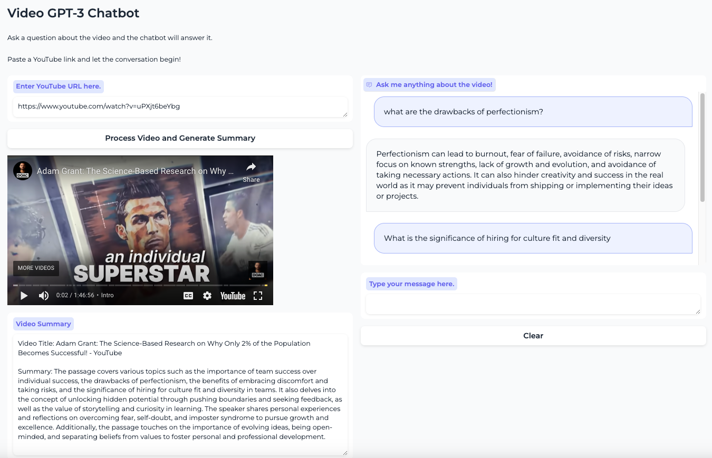

# YouTube Summary Chatbot

Welcome to the YouTube Summary Chatbot repository. This project built using Langchain for handling natural language processing and the GUI is built using Gradio.

## Overview

By uploading a YouTube URL, the chatbot generates a concise summary of the video content. But it doesn't stop there - you can also ask the bot questions about the video for more detailed insights.

This project is perfect for those who want to quickly understand the key points of a video without having to watch the entire content. It's also a great tool for researchers, students, or anyone who needs to extract information from YouTube videos efficiently.

Stay tuned for more updates and features!

## Features

- Upload YouTube URL
- Automatic video summary generation
- Interactive Q&A with the chatbot

We hope you find this project useful and we're excited to see how you use it!
## Setup
```
make init
echo "OPENAPI_API_KEY=sk-<your_actual_key_here>" > .env
source .yt_chatbot_env/bin/activate
```

## Run
```
python video_gpt
```

